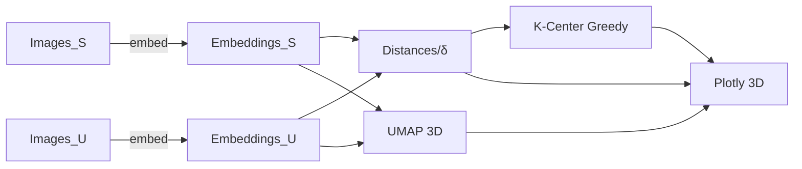

# K-Center 기반 3D 시각화(구형) 설계/구현 플랜

## 범위

- 3.1 데이터 구멍 찾기(K-Center Greedy)와 3D 시각화(구 형태 투영 포함)까지 1차 완성.
- 임베딩 추출(InternVL2의 Vision Encoder), 차원 축소(UMAP 3D, 선택: PCA), 거리/커버리지 계산, K-Center 선택, Plotly 3D 시각화.

## 디렉터리/파일 구조

- `configs/config.yaml`: 경로/하이퍼파라미터(플레이스홀더 경로 포함)
- `models/internvl_loader.py`: 로컬/HF 경로에서 InternVL2-8B 로더, 비전 인코더 추출/전처리
- `embeddings/extract.py`: 이미지 폴더 스캔→배치 임베딩 추출(L2 normalize, ROI/sky-masking 옵션)
- `analytics/dim_reduce.py`: UMAP 3D(필수), PCA(선택) 래퍼
- `analytics/distances.py`: 최근접 거리, δ-coverage(최대 최근접거리) 계산(코사인/유클리드)
- `analytics/kcenter.py`: K-Center Greedy 구현(초기 S, 후보 U에서 상위 N 선택)
- `viz/plotly_3d.py`: 3D 산점도 + 색상(최근접거리), 선택 샘플 하이라이트, 구형 투영 모드
- `tools/run_pipeline.py`: S/U→임베딩→차원축소→거리/δ→K-Center→시각화까지 일괄 실행 CLI
- `requirements.txt`: transformers, torch, umap-learn, scikit-learn, plotly, Pillow 등

## 핵심 결정

- **임베딩**: InternViT-6B last hidden state 평균 풀링(+L2 normalize), 입력 448x448 기본
- **거리**: 코사인 거리 기본(임베딩 단위벡터화), 옵션으로 유클리드 지원
- **차원축소**: UMAP 3D(시각화), PCA는 대규모 가속용(선택)
- **K-Center**: 초기 커버 세트=S, 후보=U, greedy로 상위 N 선택
- **시각화**: Plotly 3D 산점도
- 색: 각 포인트의 S까지 최근접 거리(=커버리지 관점의 부족도)
- 마커: K-Center로 선택된 U*는 강조(큰 마커/다른 심볼)
- **구형 투영 모드**: 3D 좌표를 단위 구로 정규화하여(벡터를 단위벡터로) "구 형태" 뷰 제공(토글)

## 데이터 플로우

## 구성(config) 예시 키(플레이스홀더 경로)

- `data.S_dir`: `/data/S_images` (placeholder)
- `data.U_dir`: `/data/U_images` (placeholder)
- `model.path`: `${INTERNVL2_PATH}` 없으면 `OpenGVLab/InternVL2-8B`
- `inference.image_size`: 448, `batch_size`: 8, `num_workers`: 4, `precision`: `bf16|fp16|fp32`
- `preprocess.sky_crop_top_pct`: 0.3 (0~1, 0.3이면 상단 30% 마스킹)
- `kcenter.num_select`: 100, `distance.metric`: `cosine|euclidean`
- `umap.n_neighbors`: 30, `umap.min_dist`: 0.1, `umap.metric`: `cosine`
- `viz.mode`: `cartesian|spherical`, `viz.sample_limit`: 10000

## 실행 시나리오(CLI)

- 임베딩 추출:
- `python tools/run_pipeline.py embed --split S`
- `python tools/run_pipeline.py embed --split U`
- 차원축소/거리/δ/K-Center/시각화:
- `python tools/run_pipeline.py analyze --k 100 --viz spherical`
- 결과물: `outputs/umap3d_S.npy`, `outputs/umap3d_U.npy`, `outputs/kcenter_indices.json`, `outputs/coverage.json(δ)`, `outputs/plot_3d.html`

## 정확도/성능 고려

- GPU 사용 시 `torch.cuda.amp`로 bf16/fp16; GPU 미존재 시 배치/워커 축소
- S/U가 매우 클 경우: 임베딩 캐시(np.memmap/npz), UMAP에 샘플링 옵션 제공, PCA 선행 후 UMAP

## 리스크/대응(요약)

- Domain Gap(하늘/배경 영향) → sky-crop/ROI masking 옵션, 거리/히트맵으로 검증
- 시각화 혼잡 → 샘플링, 거리 기반 알파/사이즈 매핑, 선택 포인트 강조

## 산출물

- δ-coverage 수치(JSON)
- K-Center로 선정된 상위 N 후보 인덱스/파일경로 목록